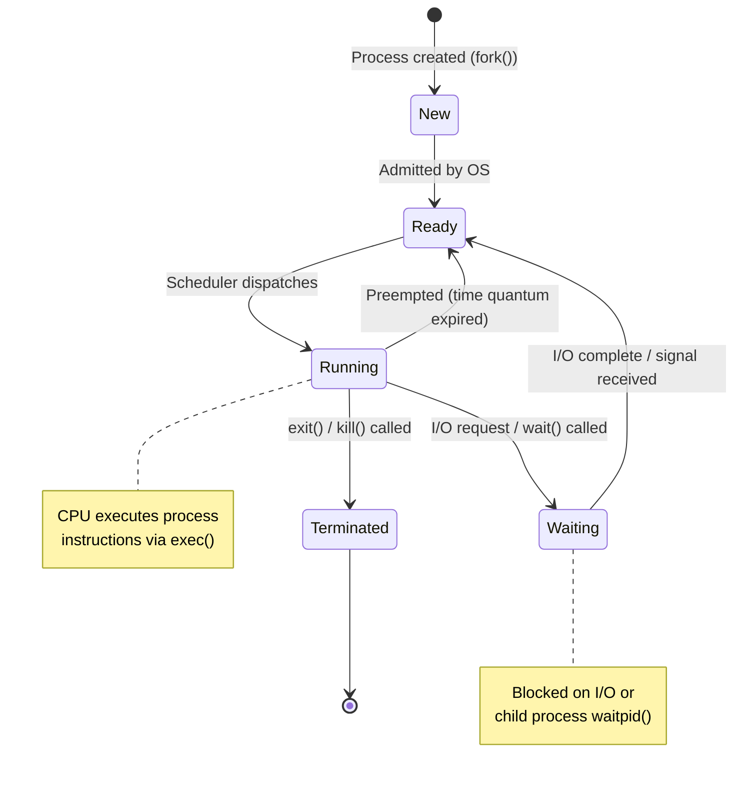

```mermaid
 stateDiagram-v2
    [*] --> New : Process created (fork())

    New --> Ready : Admitted by OS

    Ready --> Running : Scheduler dispatches

    Running --> Ready : Preempted (time quantum expired)

    Running --> Waiting : I/O request / wait() called

    Waiting --> Ready : I/O complete / signal received

    Running --> Terminated : exit() / kill() called

    Terminated --> [*]

    note right of Running
        CPU executes process
        instructions via exec()
    end note

    note right of Waiting
        Blocked on I/O or
        child process waitpid()
    end note
```
